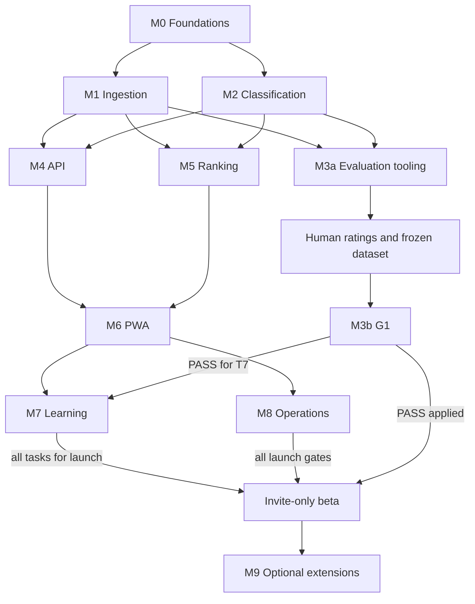

# FeedIt Next Gen: execution plan

> **What this is.** The build plan for FeedIt Next Gen, an RSS reader that classifies articles with
> TypeSafe's **Jev** decision model against each reader's plain-language **interest cards**, instead
> of a hand-tuned word-scoring engine. It is written so that Claude Code can execute it milestone by
> milestone as `/goal`s, with minimal interpretation.
>
> **Document set** (copy the whole folder into the new repository's `docs/`):
>
> | File | Role |
> |---|---|
> | `PLAN.md` (this file) | goals, milestones, tasks, order, parallelism, acceptance criteria |
> | [`specs/01-architecture.md`](./specs/01-architecture.md) | stack, repo layout, conventions, config, CI, deviation process |
> | [`specs/02-data-model.md`](./specs/02-data-model.md) | full PostgreSQL schema, roles, RLS, SQL functions |
> | [`specs/03-ingestion.md`](./specs/03-ingestion.md) | queues, safe fetcher, parsing, dedup, extraction, language, fetch schedule |
> | [`specs/04-decision-engine.md`](./specs/04-decision-engine.md) | Jev client, router, retries, breaker, spend guard, LLM fallback, Laya |
> | [`specs/05-classification.md`](./specs/05-classification.md) | question sets, taxonomy, interest cards, matching, clustering, suggestions, library |
> | [`specs/06-ranking-learning.md`](./specs/06-ranking-learning.md) | rules, lanes, tiers, explain, rank handler, personal model, BM25 |
> | [`specs/07-translation.md`](./specs/07-translation.md) | LibreTranslate tier 1, Ollama Cloud tier 2, quality checks |
> | [`specs/08-api.md`](./specs/08-api.md) | HTTP API, auth, invites, quotas, admin |
> | [`specs/09-web-app.md`](./specs/09-web-app.md) | PWA screens, interactions, keyboard, onboarding |
> | [`specs/10-evaluation.md`](./specs/10-evaluation.md) | golden set, experiments, metrics, gate G1, replay |
> | [`specs/11-operations.md`](./specs/11-operations.md) | deploy, housekeeping jobs, backups, alerts, security, launch |
> | [`background.md`](./background.md) | why: lessons from FeedIt.sk and DreamCatcher, Jev research, risks |
> | [`laya-multilingual.md`](./laya-multilingual.md) | evaluation of the open-weights Laya model (optional M9) |
>
> Specs are **binding** and are the source of truth for behaviour. This file is the source of truth for
> *order* and *done-ness*.
>
> **Review status (2026-09-25):** this is an implementation specification, not a claim that the app
> or its integrations have passed tests. Open owner decisions are tracked in §17. Their gates apply
> only to the affected work; proceed with independent fixture-based implementation.

---

## 0. How to run this plan with Claude Code

### 0.1 One milestone = one `/goal`

Claude Code's `/goal <condition>` keeps a session working, turn after turn, until a separate evaluator
model judges the condition met. The evaluator reads **only the conversation transcript**. It does not
run commands or open files. Every milestone below therefore has a ready-made **goal text** (under
4,000 characters, as `/goal` requires) that:

- points at the milestone section and the specs to follow
- states constraints (locked decisions, no scope creep)
- defines "done" as **evidence printed in the transcript**: a milestone report with every task ticked
  and its commit hash, plus the verbatim tail of the verification commands and their exit code
- bounds the run with "or stop after N turns"

This is a convenient execution wrapper, not a dependency of the application. If the installed agent
does not support `/goal` or `TaskCreate`, use the same milestone text as an ordinary task and maintain
the same task/evidence ledger. Follow the tool's actual permission configuration. See the
[official `/goal` documentation](https://code.claude.com/docs/en/goal); never treat reaching a turn
limit, a blocked prerequisite or a clean Git status as proof of feature completion.

### 0.2 Procedure for each milestone

1. **Start a fresh Claude Code session** in the new repository. A goal is session-scoped, one per
   session.
2. Switch to **auto mode** so goal turns run unattended (a goal does not change permission mode).
3. Create the milestone branch, e.g. `git switch -c m1-ingestion`. Parallel milestones use separate
   **git worktrees** (`git worktree add ../feedit-ng-m2 -b m2-classification`), one session each.
4. Paste the milestone's goal text after `/goal `.
5. Claude then:
   - reads this milestone section and the referenced spec sections
   - creates one task per row of the task table (TaskCreate), in dependency order
   - runs tasks from **different lanes in parallel with subagents** when their dependencies are met,
     following the parallel-work rules in §0.3
   - commits once per task as `<task-id>: <summary>`
   - runs the verification commands and prints the **milestone report** (§0.4)
6. Review the report, then merge the branch (a PR if you prefer) before starting dependent milestones.

### 0.3 Global rules for every goal

- Follow [`specs/01-architecture.md`](./specs/01-architecture.md) conventions. Read the spec sections
  a task cites **before** coding it.
- **Locked decisions (§2) are never changed by the implementer.** If one blocks progress, stop and
  report.
- **Spec deviations:** allowed only through spec 01 §9. Log each in `docs/DECISIONS.md` and update the
  spec in the same commit.
- **Tests:** no live third-party calls; use `packages/testing` fixtures and the fake TypeSafe server
  (spec 04 §10).
- **Live network use** is allowed only where a task or goal says so:
  - M3a-T2/T9 fetch the real golden feeds
  - M3b calls Jev, Ollama and LibreTranslate
  - M8-T7 fetches the starter-bundle feeds
- This restriction concerns product data collection and paid inference, not dependency installation,
  container pulls, documentation reads or security-advisory checks needed by the stated tasks.
- **Scope:** do not implement other milestones' tasks. Stubs and interfaces that later milestones
  fill in are fine when a task says so.
- **Parallel work inside a milestone:**
  - The lead session first adds every new dependency and every shared registration point for the
    lanes it is about to start: the `package.json` entries, handler maps, route registration, i18n
    namespaces and package `index.ts` exports.
  - Subagents then work only inside their task's files. They never run `pnpm add`, never touch the
    lockfile and never commit.
  - The lead reviews and commits each task by path.
- **Parallel milestones** (separate worktrees): only **one active branch at a time may add database
  migrations**, because the migration journal is linear. The schema is complete after M0; any later
  migration (M3a's `eval` schema, or a logged deviation) is coordinated by merging it to `main`
  before another branch adds one.
- **Verification commands** (the "full check"):
  `pnpm typecheck && pnpm lint && pnpm test && pnpm test:int`. From M6 on, also
  `pnpm e2e`. Test file naming decides what each command runs (spec 01 §6).
- **Named tests:** when a goal names a test file, show its result line explicitly (spec 01 §6,
  "Reporting named tests"). The summary tail alone does not show it.

### 0.4 Milestone report format (printed at the end of every goal)

```
## M<n> report
Branch: m<n>-<slug>   Last commit: <sha>
| Task | Status | Commit | Evidence |
| M<n>-T1 … | ✓ | abc1234 | tests: packages/feeds/test/safe-fetch.test.ts (24 passed) |
…
### Milestone "Done when"
- [x] <item> — <evidence: command + result, file path, or test name>
### Verification
$ pnpm typecheck && pnpm lint && pnpm test && pnpm test:int
<last ~15 lines of output>
exit code: 0
$ <grep for each named test of this milestone>
✓ <named test file> (<n> tests)
### Deviations logged
D-3 (M1-T6): … / none
### Notes for the next milestone
…
```

### 0.5 Cross-cutting completion contract

- **Durable work:** every state mutation needing async work writes its outbox intent atomically
  (specs 02–03). Verify rollback, crash after commit, relay crash after enqueue, duplicate delivery
  and lease expiry. Queue singleton keys are an optimization, not an exactly-once guarantee.
- **Freshness:** derived text, answers and scores are valid only for their recorded input revision,
  question/state fingerprints and ranking context. Delayed results cannot overwrite newer edits or
  recreate a deleted user's data. Missing/prefiltered answers are unknown, never negative evidence.
- **Isolation:** fixtures contain at least two users sharing feeds, with private cards/examples and
  different state. Test direct database grants/RLS and every object-ID API boundary, including
  offline replay after logout and account switching.
- **Negative paths:** each stage has bounded retries, a recoverable terminal reason and a reader-visible
  fallback. No-op stubs are registered for development discovery only: dispatch to an unimplemented
  stage stops with `stage_unavailable`, preserving its durable pending intent. It must not complete
  and discard real work. Production startup refuses any unimplemented required handler.
- **Honest evidence:** `passed`, `failed`, `blocked`, `not run` and `not applicable` are distinct.
  Report the exact commit, config/fixture versions and commands. A blocked task may end an agent
  session but does not complete its milestone or satisfy a downstream dependency.
- **Scope:** implementation is in the new repository described by spec 01. This documentation review
  does not authorize deploying over the existing PHP/MongoDB app or migrating its data.

---

## 1. Product in one page

**Promise:** "Show me what I care about from the moment I subscribe, learn from my 👍/👎, and always
tell me *why*."

**How:**
1. **Ingest** every subscribed feed once for all users, deduplicate, extract text and detect the
   language.
2. **Call A (enrich)**, once per article: content type, topic, depth, clickbait, promo, time
   sensitivity, … (Jev).
3. **Call B (match)**, once per article × each distinct **interest card** on its feeds: an absolute
   yes/no probability (Jev).
4. **Rank** per user, in code: rules (mutes, blocks, boosts) → card score → quality demotions → lanes
   **For you / Maybe / Everything else** plus tiers 1–5, with an `explain` record for "Why this?".
5. **Learn:** 👍/👎 with reasons, dwell and bookmarks train a tiny per-user logistic model on top of
   the Jev features. Maybe-lane items are the ones the app asks about (active learning).
6. **Degrade safely:** if Jev is unavailable or over budget, the app falls back to keyword ranking in
   the Maybe lane and never hides anything.

**v1 non-goals:** AI summaries or any generated text, social features, a full-text search engine,
native apps (the PWA covers mobile), and migrating FeedIt.sk data.

Background and rationale: [`background.md`](./background.md).

---

## 2. Locked decisions

| # | Topic | Decision |
|---|---|---|
| 1 | Stack | **TypeScript monorepo** (pnpm + Turborepo; Node 22; Fastify; Drizzle; pg-boss; React PWA). Details in spec 01 |
| 2 | Tenancy | **Multi-tenant from day one**: a shared article layer, per-user data under Postgres RLS |
| 3 | Generative LLM | **Only** as the fallback decision engine and for translation. No LLM card authoring, summaries or labelling teachers |
| 4 | Migration | **None.** No FeedIt.sk accounts or data. Everything is trained or fine-tuned from scratch; the golden set is built new |
| 5 | Hosting | **Self-hosted on one box, minimal spend, no GPU** |
| 6 | Signup | **Invite-only** at launch, with a waitlist |
| 7 | Translation / LLM provider | Tier 1 = **free CPU machine translation** (LibreTranslate/Argos). Tier 2 and the LLM fallback = **Ollama Cloud GLM** (`glm-5.3-flash`, `glm-5.3`). **No Claude** (too expensive for the quality needed) |
| 8 | Decision model | **Jev** (TypeSafe) through its HTTP API, pinned version (`jev-1.13.0`). Laya is an optional later engine |

**Decided by measurement at gate G1 (M3b), with defaults until then:**
- language mode per language (default `native`)
- card text mode (default `as_written`)
- lane and tier thresholds (spec 06 §11 defaults)
- the daily budget (default $2)

---

## 3. Glossary

| Term | Meaning |
|---|---|
| **Interest card** | A plain-language description of what a reader wants ("EV battery chemistry, not stock news"). Shared when the text is identical; a **fork** when it has personal examples. Strength: must / love / like / never |
| **Label** | A user-defined tag with a definition; asked like a card, suggested when p ≥ 0.8 |
| **Call A / enrich** | Jev call with the fixed question set `enrich-v1` about one article |
| **Call B / match** | Jev call with one yes/no question per pending card (plus level-2 topic questions) about one article |
| **Lane** | `new`, `for_you`, `maybe`, `everything`, `hidden` (spec 06 §6) |
| **Tier** | 1–5 from P(like); FeedIt's slider |
| **Degraded** | No model answer available; BM25 ranking, Maybe lane only |
| **Golden set** | The rated articles and facet labels collected in M3a; used for G1 and every later replay |
| **G1** | The gate after M3b that sets language modes, card text mode and thresholds, or stops the project |
| **Engine router** | The only entry point to decision models (spec 04) |

---

## 4. Milestone map



| Milestone | Depends on (merged to `main`) | Can run in parallel with | Autonomous? | Size |
|---|---|---|---|---|
| **M0** Foundations | — | — | yes | M |
| **M1** Ingestion core | M0 | M2 | yes (the fixture server is local) | L |
| **M2** Decision engine & classification | M0 | M1 | yes (fixtures and the fake engine only) | L |
| **M3a** Evaluation tooling & golden-set collection | M1, M2 | M4, M5 | yes, then a **human step** (§8.1) | M |
| **M3b** Run gate G1 | M3a + human ratings | M6, M7-T1…T6 | yes (needs API keys and network) | S |
| **M4** HTTP API | M1, M2 | M3a, M5 | yes | L |
| **M5** Ranking & lanes | M1, M2 | M3a, M4 | yes | M |
| **M6** Web app (PWA) | M4, M5 | M3b | yes | L |
| **M7** Personal learning & suggestions | M4, M5, M6 (its goal runs E2E), and **M3b for T7** (run T7 last, after M3b is merged) | M8 | yes | M |
| **M8** Operations & launch readiness | M4, M5, M6, and M3b applied; final launch gate also requires all M7 | M7 implementation only | mostly (one-time host setup is manual) | M |
| **M9** Optional extensions | launch | — | per item | — |

**Shared registration points:**
- M0 creates `apps/worker/src/pipeline.ts`, the table-driven handler map
  (`apps/worker/src/handlers/index.ts`), `packages/shared/src/jobs.ts` (every queue, payload and
  enqueue helper) and `packages/shared/src/dto/explain.ts`. Each queue starts as a stub.
- Later milestones replace the stubs: M1 fetch/extract, M2 translate/enrich/match/cluster/backfill,
  M5 rank, M7 learn/suggest, M8 house jobs.
- Merge conflicts are limited to one-line map entries.

M6 and M7 work done before G1 passes is speculative implementation. A G1 FAIL or INCONCLUSIVE
result freezes further dependent work and launch until the owner resolves it; previously completed
fixture tests do not override this gate. M8 can prepare operations in parallel with M7, but cannot
declare launch ready while any M7 task or owner launch gate is outstanding.

---

## 5. M0: Foundations

**Outcome:** an empty repository becomes a working monorepo. It has tooling, CI, per-process config,
the shared text utilities and job definitions, the full database schema with grants, RLS and
functions, the pg-boss schema and queues, per-worktree test databases, and runnable stub apps, so
every later milestone only adds code.

**Read first:** spec 01 (all), spec 02 (all), spec 03 §2 (queues) and §6.1/§8.3 (`normalizeText`,
`detectLanguage`), spec 04 §1 (the `ports.ts` types), spec 05 §2 and §5.1 (`canonicalJson`,
`cardTextHash`), spec 06 §6.2 (`Explain`), spec 08 §3.1 (preferences) and §6 (plans).

**Goal text** (paste after `/goal `):

```
Complete milestone M0 "Foundations" exactly as specified in docs/PLAN.md §5, following docs/specs/01-architecture.md and docs/specs/02-data-model.md. Start by reading PLAN.md §0–§5 and those specs, then create one task per row of the M0 task table and implement them in dependency order, using subagents for tasks in different lanes whose dependencies are met, under the parallel-work rules of PLAN.md §0.3. Commit each task separately as "<task-id>: <summary>". Constraints: do not change locked decisions in PLAN.md §2; log any spec deviation in docs/DECISIONS.md and update the spec in the same commit; no live third-party calls in tests; do not implement later milestones beyond the stubs M0 asks for. The goal is met only when the transcript shows (1) a final "M0 report" in the format of PLAN.md §0.4 listing M0-T1…M0-T8 each with ✓, commit hash and evidence, and every M0 "Done when" item checked with evidence, (2) the output of `pnpm typecheck && pnpm lint && pnpm test && pnpm test:int` run after the last commit, ending with exit code 0, plus the result lines of the named tests schema-parity.int.test.ts and rls-isolation.int.test.ts, and (3) `git status --short` printing nothing. Or stop after 120 turns and print the report with the unfinished items.
```

**Tasks**

| ID | Task | Needs | Lane | Specs |
|---|---|---|---|---|
| M0-T1 | Monorepo scaffold and tooling | — | A | 01 §1–2, §5–6 |
| M0-T2 | `packages/shared`: config, settings registry, jobs, plans, preferences, DTOs incl. `Explain`, ports, errors, ids, clock, mailer and templates, text utils | T1 | A | 01 §2–3, §5; 02 §2; 03 §2, §6.1, §8.3; 04 §1; 05 §2, §5.1; 06 §6.2; 08 §3.1, §6 |
| M0-T3 | Infra: compose files (named projects, env ports), `init.sh`, Caddy skeleton | T1 | B | 01 §4, §8; 02 §1.1; 11 §2 |
| M0-T4 | `packages/testing` (part 1): per-worktree test databases from a template, fixture HTTP server | T1, T3 | B | 01 §6; 02 §1.1 |
| M0-T5 | `packages/db`: schema, grants, RLS, SQL functions, pg-boss schema and queues in the migrate job, `withTenant`, factories (testing part 2), schema parity and RLS tests | T2, T3, T4 | A | 02 all; 03 §2 |
| M0-T6 | Seed runner (`apps/worker/src/seed.ts`) and settings defaults | T5 | A | 02 §2; 05 §2 (mechanism only) |
| M0-T7 | App skeletons (api, worker, web, eval), durable outbox relay, handler map, `pipeline.ts` stubs | T2, T5 | C | 01 §2, §4; 03 §1–2; 08 §10 |
| M0-T8 | CI workflow and `CLAUDE.md` | T1; verification after T5–T7 | C | 01 §6–7, §10 |

**Done when** (per task):

- **T1:**
  - `pnpm i` succeeds.
  - Every app and package from spec 01 §2 exists with `package.json`, `tsconfig.json`, `src/index.ts`
    and one placeholder test.
  - The strict TS flags are set.
  - Vitest configs implement the file-naming split of spec 01 §6, and `turbo.json` has
    `test:int.cache = false`.
  - The ESLint boundary rules are configured, and a test asserts that a forbidden import
    (`packages/ranker` → `packages/db`) is reported.
  - `docs/` contains this plan.
- **T2:**
  - `loadConfig({process})` covers **every** variable in spec 01 §3, with defaults and zod validation.
    Tests: `DATABASE_URL_WORKER` missing for worker fails and passes for api;
    `FETCH_ALLOW_PRIVATE=true` or `RATE_LIMITS_ENABLED=false` with `NODE_ENV=production` fails.
  - `settings.ts` has a zod schema and a default for every key in spec 02 §2, including the canonical
    `RankerConfig` schema/defaults in `shared` (ranker consumes or re-exports them).
  - `jobs.ts` has every queue of spec 03 §2 with its payload schema, options and enqueue helpers over a
    `JobSender` interface.
  - Also: `plans.ts`, the `UserPreferences` schema with defaults, `dto/explain.ts`, `ports.ts`
    (`EngineStore`), `AppError` codes, UUID v7 and bigint-string helpers, an injectable clock, and the
    mailer (a `log` transport that captures the last email).
  - Text utils:
    - `normalizeText` (tests with Slovak diacritics)
    - `canonicalJson` and `sha256Hex` (key-order stability)
    - `cardTextHash` per spec 05 §5.1: the label title is included, the owner only for private cards
    - `detectLanguage` per spec 03 §8.3, with ≥ 30 labelled samples (10 each EN/SK/CZ) at ≥ 90 %
      accuracy, the SK/CZ tie-break with a hint, and the short-text hint path (`minLength: 10` for
      card texts)
- **T3:**
  - `infra/compose.dev.yml` (`name: feedit-dev`) runs postgres, and libretranslate under the
    `translate` profile.
  - `infra/compose.test.yml` (`name: feedit-test`, port from `PG_TEST_PORT`).
  - `infra/postgres/init.sh` per spec 02 §1.1.
  - `docker compose -f infra/compose.test.yml up -d --no-recreate` works. A `psql` check lists the
    database `feedit` owned by `feedit_owner`, the three roles (the owner and the worker with
    BYPASSRLS), and the extensions.
  - Dev/test docs and scripts use `--no-recreate` for shared containers. Production deploys follow
    spec 11 and must actually replace changed application images.
- **T4:**
  - The test-DB helper implements spec 02 §1.1:
    - templates `feedit_template_<journal-hash>`, created under an advisory lock with the extensions
      and the full migrate job
    - a database per worktree and package
  - Tests show:
    - two concurrent requests for the same template create it once
    - changing the journal content yields a new template name
    - two worktree names get separate databases
  - Until M0-T5 adds migrations, the migrate step may be a no-op.
  - The fixture HTTP server serves files and scripted redirects and statuses on a random port.
- **T5:**
  - Drizzle schema plus SQL migrations implement spec 02 §1.2–§7 (not the `eval` schema, which is M3a),
    including explicit grants, RLS, all specified SECURITY DEFINER functions with their EXECUTE
    grants, and the durable outbox/revision/lease contracts.
  - The migrate job also creates the pg-boss schema and every queue from `jobs.ts`.
  - Factories: user, feed, article, card, subscription.
  - `schema-parity.int.test.ts` passes against the hand-written `expected-schema.json`.
  - `rls-isolation.int.test.ts` covers **every** per-user table: no `app.user_id` → 0 rows; user A
    cannot select, insert, update or delete B's rows.
  - The refresh functions are correct in both calling contexts of spec 02 §6 (as app inside
    `withTenant(A)` with A and B subscribed, and as worker), and never drop B's rows.
  - The API role can persist only authorized outbox intents; the relay can deliver them to pg-boss.
    A committed intent survives a process restart; rollback removes it. End-to-end relay crash
    verification completes in T7 after the worker exists.
- **T6:** `pnpm db:seed` runs idempotently. It inserts only `card_text_mode` and
  `question_sets.active = {}` (spec 02 §2), and provides the hooks M2 fills (topics, question sets,
  library). Running it twice changes nothing (a test).
- **T7:**
  - `apps/api` `buildServer()` with `/api/v1/healthz` and `/readyz` (readyz compares the newest applied
    migration with the bundled journal), tested with inject.
  - `apps/worker` boots pg-boss (`migrate: false`) and registers handlers from the map, with a **stub
    for every queue** in spec 03 §2 (unimplemented stages preserve pending work per §0.5). `pipeline.ts` has
    `after(stage, …)` with the stage order of spec 03 §1. The worker runs the outbox relay and
    tests prove crash-after-send replay, guarded lease completion and unavailable-stage retention.
  - `apps/web`: a Vite + React + TanStack Router + Tailwind + i18next shell rendering a localized
    "FeedIt" page, with the per-feature i18n layout.
  - `apps/eval`: a commander CLI with `--help`.
  - `pnpm dev` starts api, worker and web (logs shown).
- **T8:** `.github/workflows/ci.yml` per spec 01 §7, without the E2E step (M6 adds it); `CLAUDE.md` with
  the exact text of spec 01 §10; the CI commands run locally and succeed (output shown).

**Milestone done when:** all tasks are done; the full check passes; `pnpm dev` serves
`GET /api/v1/readyz → 200`.

---

## 6. M1: Ingestion core

**Outcome:** subscribed feeds are fetched safely on an adaptive schedule, and articles are stored
once, deduplicated across feeds, with extracted text and detected language. The pipeline stops after
`extract` until M2 replaces the later stubs.

**Read first:** spec 03 (all), spec 02 §3, spec 05 §5.6 (`resetArticleAnswers`), spec 01 §5.

**Goal text:**

```
Complete milestone M1 "Ingestion core" exactly as specified in docs/PLAN.md §6, following docs/specs/03-ingestion.md, docs/specs/02-data-model.md §3 and the conventions in docs/specs/01-architecture.md. Read PLAN.md §0, §2, §6 and the referenced specs first, create one task per row of the M1 task table, and implement them in dependency order, running tasks from different lanes in parallel with subagents under the parallel-work rules of PLAN.md §0.3. Commit each task as "<task-id>: <summary>". Constraints: locked decisions in PLAN.md §2 are not changed; spec deviations go to docs/DECISIONS.md with the spec updated in the same commit; tests use local fixtures only (no internet); do not implement M2+ stages beyond calling the existing pipeline stubs. The goal is met only when the transcript shows (1) a final "M1 report" in the format of PLAN.md §0.4 listing M1-T1…M1-T9 each with ✓, commit hash and evidence, and every M1 "Done when" item checked with evidence, (2) the output of `pnpm typecheck && pnpm lint && pnpm test && pnpm test:int` run after the last commit, ending with exit code 0, plus the result line of the named test ingestion.e2e.test.ts, and (3) `git status --short` printing nothing. Or stop after 200 turns and print the report with the unfinished items.
```

**Tasks**

| ID | Task | Needs | Lane | Specs |
|---|---|---|---|---|
| M1-T1 | `safeFetch`: IP-literal and DNS address checks, injectable resolver, manual redirects, limits, charset decoding | — | A | 03 §4 |
| M1-T2 | `canonicalizeUrl`, `url_key`, tracking-param list | — | B | 03 §5 |
| M1-T3 | `parseFeed`, `normalizeItem`, sanitizing, `title_norm`, `content_hash`, feed fixtures | — | B | 03 §6, §12 |
| M1-T4 | `nextSchedule` adaptive interval, with simulations | — | C | 03 §9 |
| M1-T5 | Extraction: skip list, robots, Readability, body lead, canonical detection, politeness limiter | T1 | A | 03 §8 |
| M1-T6 | Feed discovery and OPML parse/export | T1, T3 | A | 03 §10–11 |
| M1-T7 | Worker handlers: `feed.schedule`, `feed.fetch` (ingest §7, redirect merge §9), `article.extract` (alias/merge), `feeds.lang_hint` upkeep, `resetArticleAnswers` repository function | T1–T5 | D | 03 §1–3, §7–9; 05 §5.6 |
| M1-T8 | End-to-end ingestion integration test | T7 | D | 03 all |
| M1-T9 | Dev CLI (`apps/worker/src/cli.ts`, run as `pnpm worker-cli …`): `feeds:add <url> [--user dev@localhost]`, `feeds:fetch-now <feedId>`, `feeds:show <feedId>` | T6, T7 | D | 03 §10 |

**Done when:**

- **T1:**
  - All SSRF tests run with the escape hatch **off**:
    - the injected resolver maps names into every blocked IPv4/IPv6 range (all rejected)
    - IP-literal URLs `127.0.0.1`, `[::1]`, `[::ffff:127.0.0.1]`, `2130706433` and `0x7f.1` are rejected
    - a public name that redirects to a private literal or name is rejected on that hop
    - `safeLookup` with `{all: true}` returns an array
  - Also tested: more than 5 hops, a disallowed port, the decompressed-size cap and a timeout.
  - With `FETCH_ALLOW_PRIVATE=true`, a fixture server on a random port is reachable.
  - windows-1250 and `<meta charset>` fixtures decode correctly.
  - Returns the result union and never throws for network or HTTP errors.
- **T2:** ≥ 40 table-driven cases pass (IDN, repeated params, fragments and hash-bangs, tracking params,
  AMP unchanged, linkless keys with the pinned formula).
- **T3:**
  - Every fixture in spec 03 §12 parses to the expected `NormalizedItem`s (snapshots).
  - The lenient XML retry fixes the unescaped-`&` fixture.
  - Sanitizer tests pass: scripts stripped, links rewritten, pixels removed.
- **T4:**
  - Unit tests cover every branch of spec 03 §9.
  - The 60-day simulations assert `fetch_interval_s` **before jitter**: a busy feed stays ≤ 1,800 s, a
    daily blog ≤ 43,200 s, a weekly podcast reaches ≥ 86,400 s, and a broken feed goes
    `quarantined` and returns to `active`.
- **T5:**
  - HTML fixtures: normal article, paywall teaser, AMP with `rel=canonical`, windows-1250 meta, list
    page (→ `no_content`). Each produces the expected status, `body_lead` (≤ 1,500 chars,
    sentence-cut) and word count.
  - A robots.txt disallow → `blocked`.
  - A limiter test with fake timers proves ≤ 2 concurrent requests and ≥ 1 s spacing per origin.
- **T6:**
  - Discovery covers: a direct feed, HTML with `<link rel=alternate>` (one, or several → candidates),
    a fallback path probe, and not-a-feed.
  - OPML import covers nested folders, duplicates and invalid entries (reported as
    `{index, url, reason}`); the export round-trips.
- **T7:**
  - Handlers implement spec 03 §7: exact URL and feed-scoped GUID identity; fuzzy candidates are
    clustering hints, not destructive merges; stale marking; a title/excerpt/source
    change increments the input revision and calls `resetArticleAnswers`.
  - They implement the §9 feed updates, including the permanent-redirect merge (subscriptions,
    `feed_items`, scopes and rule values moved; a full rank enqueued).
  - `article.extract` performs the redirect and `rel=canonical` alias/merge, then calls
    `pipeline.after('extract')`.
  - `lang_hint` is set per §8.3.
  - A **newly inserted `feed_items` row** for an already enriched, matched or degraded article queues
    that feed's `feed_cards` into `match_queue`, enqueues `article.match`, and enqueues an incremental
    rank for the feed's subscribers (spec 03 §7), including on the extract merge and the feed merge.
- **T8:** `ingestion.e2e.test.ts` uses the fixture server: 3 feeds (RSS, Atom, JSON Feed) where 2 share
  an article, plus article pages. It asserts:
  - the articles are unique and `feed_items` link both feeds
  - bodies are extracted and `lang` is set
  - feed stats and `next_fetch_at` are updated
  - a Google-News-style redirect merges into the existing article
  - stale items are not extracted
  - a second feed newly carrying an already-matched article gets that feed's cards queued in
    `match_queue`
  - merging preserves ratings/bookmarks/labels/read state for both users; old jobs resolve survivor
    aliases; out-of-order fetch/extraction results cannot overwrite a newer revision
- **T9:** the CLI commands work against the dev DB. The output is shown for a fixture feed, including
  auto-creating the dev user.

**Milestone done when:** all tasks are done, the full check passes, and coverage of `packages/feeds`
is ≥ 80 % (shown).

---

## 7. M2: Decision engine and classification

**Outcome:**
- Articles are enriched (Call A) and matched against interest cards (Call B) through a budgeted,
  breaker-protected engine router, with optional translation.
- Story clustering runs.
- The immutable card and label lifecycle, the library seed and the ranker bootstrap (card score and
  BM25) exist.
- Everything is tested against fixtures and the deterministic fake TypeSafe server, with no live calls.

**Read first:** spec 04 (all), spec 05 (all), spec 07 (all), spec 06 §4.1 and §9, spec 02 §3.1 and §6.

**Goal text:**

```
Complete milestone M2 "Decision engine and classification" exactly as specified in docs/PLAN.md §7, following docs/specs/04-decision-engine.md, 05-classification.md, 07-translation.md, and 06-ranking-learning.md §4.1 and §9, with the conventions of docs/specs/01-architecture.md. Read PLAN.md §0, §2, §7 and those specs first, create one task per row of the M2 task table, and implement them in dependency order, using subagents for independent lanes under the parallel-work rules of PLAN.md §0.3. Commit each task as "<task-id>: <summary>". Constraints: Jev is called only through its documented HTTP API from packages/engine; no live calls to TypeSafe, Ollama or LibreTranslate in tests (use fixtures, the fake TypeSafe server and fake servers); locked decisions in PLAN.md §2 unchanged; deviations logged in docs/DECISIONS.md with the spec updated. The goal is met only when the transcript shows (1) a final "M2 report" in the format of PLAN.md §0.4 listing M2-T1…M2-T11 each with ✓, commit hash and evidence, and every M2 "Done when" item checked with evidence, (2) the output of `pnpm typecheck && pnpm lint && pnpm test && pnpm test:int` run after the last commit, ending with exit code 0, plus the result lines of the named tests classification.e2e.test.ts and engine-breaker.int.test.ts, and (3) `git status --short` printing nothing. Or stop after 220 turns and print the report with the unfinished items.
```

**Tasks**

| ID | Task | Needs | Lane | Specs |
|---|---|---|---|---|
| M2-T1 | Engine types and answer normalization | — | A | 04 §1–2 |
| M2-T2 | `TypeSafeEngine` HTTP client, status handling, fixtures, **fake TypeSafe server** | T1 | A | 04 §3, §10 |
| M2-T3 | `EngineRouter`: retries, priority semaphore, rate limiter, breaker (mirror and reset polling), spend guard, `EngineStore` implementation in `packages/db`, `usage_daily`, `recordExternalCall`/`canSpend`, eval overrides | T2 | A | 04 §1, §4–7 |
| M2-T4 | `LlmFallbackEngine` (Ollama Cloud), off by default, wired into the router's fallback chain | T3 | A | 04 §5, §8 |
| M2-T5 | `packages/questions`: builders, taxonomy, `enrich-v1`, dynamic-set templates (`match-v1`, `cluster-v1`, `suggest-v1`), card and label builders, packing, `flattenFacets` | — | C | 05 §2–6 |
| M2-T6 | Card library seed (≥ 150 cards), and seeding of topics, question sets (active kind only if absent) and library (slug upsert rules) | T5 | C | 05 §2, §8 |
| M2-T7 | `packages/translate`: LibreTranslate and Ollama translators, `assessTranslation`, best-row selection | — | B | 07 |
| M2-T8 | Card and label lifecycle repository (immutability, forks, title overrides, labels with `array_replace`, effects) | — | C | 05 §5.1, §5.3 |
| M2-T9 | Worker handlers: `article.translate`, `article.enrich`, `article.match`, `card.backfill`, `article.cluster`, `house.rescore-degraded` | T3, T5, T7, T8 | D | 05 §3–6; 07 §3; 04 §5; 03 §1 |
| M2-T10 | Ranker bootstrap: `cardScore`, BM25 (window corpus), lane/tier boundary helpers, `RANKER_VERSION` and composite `scoreVersion()` in `packages/ranker`; consume shared `RankerConfig` | T5 | E | 06 §4.1, §7, §9 |
| M2-T11 | Integration tests: classification end-to-end, breaker, budget, degraded path, backfill | T4, T6, T9, T10 | D | 04 §10; 05 §11 |

**Done when:**

- **T1:** normalization tests cover probabilities not summing to 1 (renormalize inside tolerance,
  reject outside), missing or mistyped keys, score recomputation, and entropy confidence.
- **T2:**
  - Fixture tests for 200 (all three answer types), 401, 422 and 429 (with `Retry-After`).
  - The request body matches spec 04 §3 exactly (snapshot).
  - Cost = input tokens × price per million ÷ 1,000,000; retries/fallback attempts are included.
  - The fake server implements the spec 04 §10 answer rules, `failRate` (deterministic per logical
    request) and `latencyMs`. Unit tests cover each rule.
- **T3:**
  - Fake-timer tests: the retry schedule; breaker transitions with the doubling open duration; auth
    mode; the mirror written to `settings`; reset by `resetRequested` within one poll; the spend guard
    (UTC day, `kind='eval'` excluded, the 10 % interactive allowance, `budgetOverrideUsd`); rate-limiter
    waits.
  - One `engine_calls` row per wire attempt, linked by logical request ID; atomic reservations
    prevent concurrent calls from exceeding the budget. Crash/timeout uncertainty remains charged
    conservatively until reconciled (spec 04).
  - `usage_daily` upserts (integration).
  - Crossings recorded in `engine.budget_alerts` without sending email.
- **T4:** bounded JSON prompt/validation tests for noul/choice/score; post-processing normalizes; a malformed-JSON
  fixture → `error`; router tests prove it is used only when enabled, interactive, under the daily cap
  and with its own breaker closed.
- **T5:**
  - Hash stability across key order.
  - The template sha of each dynamic set equals its stored definition's sha.
  - `ENRICH_V1` passes the TypeSafe limits.
  - Taxonomy integrity (20 L1 entries, unique ids, parents exist).
  - Snapshots of the card and label questions (the label uses the card title).
  - Packing with 500 synthetic cards respects both token limits and the count limit.
  - `flattenFacets` snapshot.
  - The cluster fold truth table.
- **T6:**
  - ≥ 150 library cards, ≥ 5 per L1 (except `other`), ≥ 15 SK/CZ-specific, including the 10 examples
    of spec 05 §8.
  - A validation test enforces length, structure and valid topic IDs; positive wording is guidance,
    not a substring ban that rejects words containing “not” or legitimate interests (spec 05).
  - The seed is idempotent.
  - A changed library text follows the slug rules (new card, slug moved, holders re-pointed; tested).
  - `question_sets.active` is filled only for absent kinds.
- **T7:** a fake LibreTranslate server (ok/weak/fail/timeout); the `assessTranslation` truth table;
  best-row selection; skipped tier-2 rows.
- **T8:** repository integration tests for **every** row of the spec 05 §5.1 lifecycle table:
  - immutability: no card body ever updated, except the one-time `*_en` fill
  - fork privacy: another user never receives a fork
  - title override
  - label rename and example with `label_ids` migrated by `array_replace`
  - un-retire on reuse
  - `refresh_feed_cards` in the same transaction
  - the returned effects
- **T9:**
  - Handlers implement spec 05 §5.5: short leased `SKIP LOCKED` claims, current revision/fingerprint
    checks, separate private-owner batches, provisional prefilter semantics, L2-only work, packing
    and guarded completion. Exhausted rows remain recoverable; incomplete coverage is per reader.
  - Enrich outcomes: engine unavailable → `degraded` plus rank enqueued for all subscribers;
    `invalid_request` → `failed`.
  - The cluster candidate SQL of spec 05 §6, with the per-feed rule in code.
  - Backfill inserts queue rows with priorities 2/6 in pages of 500, skipping only current answered
    pairs and persisting continuation until the complete eligible window is covered.
  - `pipeline.after` runs extract → (translate) → enrich → cluster + match.
  - `house.rescore-degraded` re-enqueues degraded and `llm`-answered articles, reading the breaker
    **mirror**.
- **T10:** unit tests for the strength weights, scope and missing answers; BM25 ordering on a
  hand-made corpus with window-level document frequencies; `P = 1 − exp(−s/3)`;
  the composite `scoreVersion()` key of spec 06 §7 is exported for the API/rank handler;
  global version changes are collision-free and per-user/context changes invalidate rank revisions.
  Pure lane/tier helpers support evaluation before M5 implements the full production ranker.
- **T11:**
  - `classification.e2e.test.ts`: a seeded article, 3 cards and 1 label, against the fake TypeSafe
    server → `article_facets`, `card_answers`, `article_topics_l2`, and `pipeline_state='matched'`.
  - `engine-breaker.int.test.ts` exactly as described in spec 04 §10.
  - A budget-exceeded test → `degraded`.
  - A backfill that drains in ≤ 2 engine calls.

**Milestone done when:** all tasks are done, the full check passes, and coverage of `packages/engine`,
`packages/questions` and `packages/ranker` is ≥ 80 % (shown).

---

## 8. M3a: Evaluation tooling and golden-set collection

**Outcome:**
- `apps/eval` can ingest a real EN/SK/CZ sample, serve the blind rating and facet-labelling pages to
  raters, run all experiments within their own budget, compute every metric, and generate the G1
  report and `apps/eval/config/g1.json`.
- This is proven end-to-end on **synthetic** data in a separate database.
- The real sample is ingested and the rater URLs are ready. The humans then rate.

**Read first:** spec 10 (all), spec 02 §7, spec 04 §1 (eval overrides), spec 06 §4 and §9, spec 05 §3,
spec 07.

**Goal text:**

```
Complete milestone M3a "Evaluation tooling and golden-set collection" exactly as specified in docs/PLAN.md §8, following docs/specs/10-evaluation.md and the conventions of docs/specs/01-architecture.md. Read PLAN.md §0, §2, §8 and the referenced specs first, create one task per row of the M3a task table, and implement them in dependency order, using subagents for independent lanes under the parallel-work rules of PLAN.md §0.3. Commit each task as "<task-id>: <summary>". Constraints: no Jev/Ollama calls are made in this milestone (experiments are exercised with the fake TypeSafe server and synthetic raters only, in the separate dry-run database); live network use is allowed only for fetching the real golden feeds (M3a-T2, M3a-T9); locked decisions unchanged; deviations logged in docs/DECISIONS.md. The goal is met only when the transcript shows (1) a final "M3a report" in the format of PLAN.md §0.4 listing M3a-T1…M3a-T9 each with ✓, commit hash and evidence, and every M3a "Done when" item checked with evidence, (2) the output of `pnpm typecheck && pnpm lint && pnpm test && pnpm test:int` run after the last commit, ending with exit code 0, (3) the dry-run report path and its printed decision table, (4) the `eval status` output after the real sample was ingested, and (5) `git status --short` printing nothing. Or stop after 180 turns and print the report with the unfinished items.
```

**Tasks**

| ID | Task | Needs | Lane | Specs |
|---|---|---|---|---|
| M3a-T1 | `eval` schema migration (incl. `eval.sample`, grants) and the eval system user | — | A | 02 §7 |
| M3a-T2 | CLI skeleton; `feeds-golden.txt` (18–22 feeds per language); `ingest-sample` (worker heartbeat check, drain wait, `--watch`); `sample`; `status` | T1 | A | 10 §2.1 |
| M3a-T3 | Rating server: rater add/token (`EVAL_PUBLIC_URL`), card-writing step, feed picking, assignment algorithm, blind rating UI | T1, T2 | B | 10 §2.2, §2.4 |
| M3a-T4 | Facet labelling page | T3 | B | 10 §2.3 |
| M3a-T5 | Metrics library | — | C | 10 §4 |
| M3a-T6 | Experiment runner (eval router with `budgetOverrideUsd`, `ignoreDailyCaps`, `kind:'eval'`, `EVAL_CACHE_DIR` cache, estimate, `--yes`/`--max-usd`); experiments B0, B1, B1-T, E1, E2, E3, E3b, E4 (E5 stub); `eval replay` | T1, T2 | D | 10 §3, §6 |
| M3a-T7 | Report generator, decision rules, `apps/eval/config/g1.json` schema, `apply-g1` with the field → settings mapping | T2, T5, T6 | C | 10 §1, §5 |
| M3a-T8 | `eval dry-run` in the separate `feedit_eval_dryrun` database: simulated raters and the fake engine → full report | T3–T7 | D | 10 all |
| M3a-T9 | Real sample ingested and the rater onboarding kit | T2, T3 | A | 10 §2 |

**Done when:**

- **T1:** the migration applies with the eval grants; the eval user exists; a worker with
  `EVAL_INGEST_ONLY=true` stops after extract (a test).
- **T2:**
  - `feeds-golden.txt` has 18–22 feeds per language and the category mix of spec 10 §2.1.
  - `ingest-sample --dry-run` lists the feeds and their reachability.
  - `ingest-sample` exits with instructions if no worker heartbeat is found.
  - `sample` stores up to 500/500/500 in `eval.sample` with frozen input snapshots, story-grouped
    development/test splits and reproducible hashes (integration tests on fixture data).
  - Ordinary workers cannot consume the isolated golden database's queues; a heartbeat alone is
    not sufficient isolation.
  - `status` prints per-language and per-rater counts.
- **T3:**
  - Integration tests cover:
    - the card-writing gate (no rating before ≥ 5 cards)
    - feed picking (≥ 10)
    - the assignment algorithm (equal language split, top-up, deterministic shuffle)
    - the blind page (no model fields in the HTML)
    - keyboard handlers, and rating persistence and change
  - Token-cookie auth, one-time URL exchange/redaction, rater-scoped access and revocation.
  - Pages work at a 375 px width (a DOM test).
- **T4:** the labelling page stores all six fields; the second labeller's overlap subset is chosen
  deterministically.
- **T5:** AUC matches known Mann–Whitney values, including ties; bootstrap CI determinism with a seed;
  P@k; ECE; macro-F1; Spearman; Cohen's κ; isotonic regression. All unit-tested.
- **T6:**
  - Each experiment is a config object.
  - Calls go through an eval router: `kind: 'eval'`, with the budget override and the cap bypass.
  - The cache lives in `EVAL_CACHE_DIR`. A counting fake engine proves re-runs hit it.
  - The estimate is printed, and confirmation is required above $1 unless `--yes`.
  - `eval.runs` / `eval.run_answers` are written.
  - `eval replay` produces a diff report against a stored run (tested on fixture runs).
- **T7:**
  - The report renders every table of spec 10 §4 and one reliability SVG per language.
  - The decision rules of spec 10 §5 are pure functions with a unit test for every branch: E*
    eligibility, split isolation, actual composed production configuration, insufficient-coverage
    INCONCLUSIVE state, tier-2 cap, per-language pooling and the isotonic fallback.
  - `apps/eval/config/g1.json` validates against a zod schema.
  - `apply-g1` writes exactly the settings in the spec 10 §1 mapping table.
- **T8:**
  - `eval dry-run` creates `feedit_eval_dryrun` from the template.
  - It generates 4 synthetic raters whose ratings follow a hidden per-rater interest model, and uses
    the fake TypeSafe server.
  - It runs every experiment and writes `reports/DRYRUN-<date>.md` and `.g1.json` (both git-ignored).
  - It prints the decision table.
  - A test asserts that E1 beats B0 on the synthetic data.
- **T9:**
  - `ingest-sample` ran on the real feed list, and `eval status` shows per-language counts.
  - `docs/eval/RATERS.md` explains the rating task in English and Slovak, and `docs/eval/TUNNEL.md`
    explains exposing the rating server with a tunnel.
  - `eval rater add` printed a working URL for the owner.

**Milestone done when:** all tasks are done, the full check passes, the dry-run report exists, and the
real sample has ≥ 300 articles per language. A shortfall is reported as collection pending with
a monitoring command; a background `--watch` process is not completion evidence.

### 8.1 Human step (between M3a and M3b, about 1–2 weeks, in parallel with M4–M6)

1. Keep the dedicated evaluation worker/database running with `EVAL_INGEST_ONLY=true` so candidate
   articles keep growing; do not mutate frozen rated samples. `ingest-sample --watch` monitors it.
2. Start the rating server on the dev box (`pnpm evaluate serve-rating`) and expose
   it through a tunnel (`docs/eval/TUNNEL.md`). `golden-v1` lives in a dedicated evaluation database on the dev host.
3. Add 3–5 raters (`eval rater add --name … --langs …`) and send them their URLs and `RATERS.md`.
4. Each rater writes 5–10 interests, picks ≥ 10 feeds, and rates ≥ 250 articles.
5. The owner labels facets for 100 articles per language (a second person labels 50 if possible).
6. Check progress with `eval status` and back up the self-contained golden snapshot plus referenced
   content/cards/feeds (spec 10). An eval-schema-only dump cannot restore its public-table foreign
   keys. Continue to M3b only when the coverage/split preflight in spec 10 passes.

---

## 9. M3b: Run gate G1

**Outcome:** the experiments run on the real golden set with live Jev, LibreTranslate and Ollama. The
G1 report and `apps/eval/config/g1.json` are committed. Either the core bet passes and the settings are applied
(dev), or the build stops with a clear report for the owner.

**Needs:** `TYPESAFE_API_KEY`, `OLLAMA_API_KEY`, LibreTranslate running (`--profile translate`),
network access, and the isolated golden database holding `golden-v1`. Preflight verifies the installed MT language
paths and both providers' actual model/response capabilities; unsupported experiment variants are
reported as blocked, never replaced by mislabeled native/fallback output.

**Goal text:**

```
Complete milestone M3b "Run gate G1" as specified in docs/PLAN.md §9 and docs/specs/10-evaluation.md §3–§5. Read those sections first and create one task per row of the M3b task table. Live calls to TypeSafe Jev, Ollama Cloud and the local LibreTranslate are allowed in this milestone; run every experiment with `--yes --max-usd <10 minus the actual spend so far>`, print the estimate before each experiment and the actual cost after, and keep the total under $10. Constraints: do not change the decision rules or thresholds of spec 10 §5 to get a different outcome; do not change locked decisions; commit the report and config as "M3b-T<n>: <summary>". The goal is met only when the transcript shows (1) a final "M3b report" in the format of PLAN.md §0.4 (the Verification section may show only `pnpm typecheck` because no code changes) listing M3b-T1…M3b-T4, (2) the printed G1 decision table from the committed report apps/eval/reports/G1-<date>.md with every rule's inputs and result, (3) either "CORE BET: PASS" with apps/eval/config/g1.json committed and the `eval apply-g1` output listing the settings written, or "CORE BET: FAIL/INCONCLUSIVE" with the failure/coverage summary of spec 10 §5 printed for the owner, (4) the total actual spend printed, and (5) `git status --short` printing nothing. Or stop after 80 turns and print what is missing.
```

**Tasks**

| ID | Task | Needs | Specs |
|---|---|---|---|
| M3b-T1 | Preflight: coverage/classes/facets and frozen split pass spec 10 readiness; actual model/MT capabilities verified; keys valid with budgeted tiny calls; total estimate printed | ratings | 10 §2–3 |
| M3b-T2 | Run B0, B1, B1-T, E1, E2, E3, E3b, E4 (E5 only if Laya is installed), each with `--yes --max-usd <10 − spent so far>` | T1 | 10 §3 |
| M3b-T3 | Select/tune only on development groups; lock config and evaluate held-out production policy; report PASS/FAIL/INCONCLUSIVE; write `apps/eval/config/g1.json` (runs/snapshot/split hashes), commit | T2 | 10 §1, §4–5 |
| M3b-T4 | On PASS: `apply-g1` to the dev settings, and record the production values to apply in `docs/DECISIONS.md` (daily budget recommendation, language modes, card text mode, thresholds, tier-2 cap; Q1 governs production cap increases). On FAIL/INCONCLUSIVE: write `docs/G1-FAIL.md` with the rule 1 details and the 20 worst-ranked liked articles | T3 | 10 §1, §5 |

**Milestone done when:** the report is committed and the goal evidence is printed. **If G1 fails or is inconclusive, freeze dependent work and launch until the owner decides (§4).**

---

## 10. M4: HTTP API

**Outcome:** the complete `/api/v1` of spec 08:
- auth with invites and the admin bootstrap
- tenancy with lazy per-request RLS transactions
- subscriptions with discovery, OPML and folders
- immutable cards, labels and library
- reading with cluster folding
- feedback and rules
- admin (through SECURITY DEFINER functions)
- quotas, rate limits, CSRF and OpenAPI

**Read first:** spec 08 (all), spec 02 §1.2, §4–6, spec 05 §5.1, spec 06 §6–8 (the fields it returns
and the learn trigger), spec 03 §10–11, spec 07 §5 (card text translation).

**Goal text:**

```
Complete milestone M4 "HTTP API" exactly as specified in docs/PLAN.md §10 and docs/specs/08-api.md, using the existing packages (shared, db, questions, feeds, translate, ranker types) and the conventions of docs/specs/01-architecture.md. Read PLAN.md §0, §2, §10 and the referenced specs first, create one task per row of the M4 task table, and implement them in dependency order, using subagents for independent lanes under the parallel-work rules of PLAN.md §0.3. Commit each task as "<task-id>: <summary>". Constraints: every tenant-owned query runs through req.withTx/TenantTx under RLS as feedit_app; auth/control-plane repositories follow spec 02 explicit exceptions; state and async intents commit atomically through the outbox; its relay enqueues via packages/shared/src/jobs.ts; no live third-party calls in tests (emails use MAIL_TRANSPORT=log); locked decisions unchanged; deviations logged in docs/DECISIONS.md with the spec updated. The goal is met only when the transcript shows (1) a final "M4 report" in the format of PLAN.md §0.4 listing M4-T1…M4-T11 each with ✓, commit hash and evidence, and every M4 "Done when" item checked with evidence, (2) the output of `pnpm typecheck && pnpm lint && pnpm test && pnpm test:int` run after the last commit, ending with exit code 0, plus the result lines of the named tests api-rls-isolation.int.test.ts and api-operations.test.ts, and (3) `git status --short` printing nothing. Or stop after 220 turns and print the report with the unfinished items.
```

**Tasks**

| ID | Task | Needs | Lane | Specs |
|---|---|---|---|---|
| M4-T1 | Plugins: errors, tenant (`req.withTx`, lazy), session auth, CSRF (bearer exemption), rate limit (`RATE_LIMITS_ENABLED`), zod provider, swagger | — | A | 08 §1, §11 |
| M4-T2 | Auth, email (templates en/sk), invites, waitlist, admin bootstrap, restore on verify | T1 | A | 08 §2 |
| M4-T3 | Me, preferences, sessions, export, delete | T1 | B | 08 §3 |
| M4-T4 | Subscriptions: discovery (outside the transaction), OPML, folder rename, `refresh_*` with plan intervals, backfill enqueue | T1 | B | 08 §4; 03 §10–11 |
| M4-T5 | Cards, library, suggestions, labels, topics, card-text translation (english mode), through the M2 lifecycle repository | T1 | C | 08 §7; 05 §5.1; 07 §5 |
| M4-T6 | `GET /articles` (candidate set → folding → filters → sort), counts, details, calibration, lazy full rank | T1 | D | 08 §5.1–5.2; 06 §7, §10 |
| M4-T7 | Article actions and `feedback_events`; the learn trigger; the rank enqueues for cluster reads | T6 | D | 08 §5.3; 06 §7, §8.4 |
| M4-T8 | Rules endpoints | T1 | C | 08 §8; 06 §3 |
| M4-T9 | Admin endpoints (definer functions, settings side effects, promote in place, invites list), `ops-event`, `/metrics`, test-only `/dev/last-email` | T1 | E | 08 §9–10; 02 §6 |
| M4-T10 | Quota enforcement across endpoints | T4, T5, T8 | B | 08 §6 |
| M4-T11 | Suites: RLS isolation, CSRF, write-path grants, enqueue, OpenAPI snapshot, operations list | T2–T10 | E | 08 §12 |

**Done when:**

- **T1:**
  - The error mapping table is tested.
  - A request that never touches per-user data opens no transaction (a spy); `app.user_id` is set
    inside `withTx` (integration).
  - Unauthenticated → 401. A mutation without `X-FeedIt-Client` → 403, but a `METRICS_TOKEN` bearer is
    exempt.
  - Rate-limit headers are present, and limits are off only when `RATE_LIMITS_ENABLED=false` in test.
- **T2:**
  - Every row of the `request-code` decision table is tested, including the admin bootstrap with an
    empty `invites` table and a soft-deleted user.
  - Code TTL/attempt limits, simultaneous verification/resend, invite-consumption and quota races;
    the locale stored on the code row.
  - Signup consumes the invite; the admin role is re-applied on every verify.
  - Restore on verify refreshes the feeds and ranks.
  - Cookie attributes, session sliding and revocation.
  - The waitlist upsert.
- **T3:** the preferences deep-merge is validated, including the new fields (`theme`, `folderOrder`,
  `onboardingCompletedAt`); the export contains every section; delete calls the refresh functions (the
  deleted user's feeds lose them as a subscriber); a login within 7 days restores.
- **T4:**
  - Discovery runs before the transaction (a spy) and returns candidates.
  - OPML import report and export round-trip.
  - Folder rename.
  - Subscribe calls `refresh_feed_subscribers` with the plan intervals (`min_interval_s` set) and
    `refresh_feed_cards`, then enqueues a backfill **and** `user.rank {full: true}` (asserted in
    pg-boss). OPML import enqueues the same.
- **T5:**
  - Every card and label endpoint maps to its lifecycle action; a changed id is returned.
  - `POST /articles/:id/labels` never changes cards (asserted).
  - Label rename or example migrates `label_ids` (asserted).
  - English mode stores `interest_en` and `lang` (a fake LibreTranslate).
  - Library localization (sk); suggestions dismiss.
- **T6:**
  - Lanes and statuses filter correctly, with folding applied before filtering (the mixed
    `allow_duplicates` case is tested).
  - Bookmarks default to `status=all` and ignore the window.
  - Each sort order follows the declared cursor/snapshot contract under reranking, new arrivals,
    expired cursors, account/filter mismatch and equal sort keys (property/integration tests).
  - The counts agree with the list totals and include `scored` and `total`.
  - An outdated `score_version` enqueues a full rank.
  - The 404 rule. `lane=hidden` supports explicit review/recovery without appearing in normal
    lanes; explicit hide undo/unhide works and model/rule hiding links to the relevant control.
- **T7:**
  - Every action is tested, including un-rate, hide, bulk rate with `null` (undo), a prompt answer
    stored as a rating, `unread` recorded, and mute-story creating a cluster when missing.
  - `/dwell` validates bounded durations and sets `feedback_prompted_at` when it answers `prompt:true`.
  - Mutations retry with the same idempotency key; conditional undo restores prior values and
    rejects conflicting later edits. Mixed valid/foreign bulk IDs cannot partly mutate another user.
  - The learn trigger fires at the 10th, 20th … explicit label since the last training.
- **T8:** value validation per kind; creating or deleting a rule enqueues `user.rank {full:true}`.
- **T9:**
  - Admin only (403 for users).
  - The settings allow-list, with zod per key and every side effect of spec 08 §9 tested.
  - Reset-breaker writes `resetRequested`.
  - `GET /admin/library/candidates` lists shared cards with ≥ `minHolders` holders.
  - Promote requires ≥ 3 holders (via `admin_card_holders`) and updates in place.
  - Usage uses `admin_usage_attribution`.
  - The `ops-event` token check and storage in `ops.events`.
- **T10:** the six quota limits (`maxFeeds`, `maxCards`, `maxLabels`, `maxForks`, `maxRules`,
  `opmlMaxFeeds`) each have a boundary test (max OK, max+1 → `QUOTA_EXCEEDED` with details), and label
  forks are not counted in `maxForks`.
- **T11:**
  - `api-rls-isolation.int.test.ts` calls **every** GET endpoint as user A with B's data seeded (shared
    cards with B's private fork, B's labels, rules, bookmarks) and asserts no leakage.
  - Every mutation endpoint passes as `feedit_app` (grants).
  - Transactional outbox rollback/restart and relay duplicate-delivery tests pass.
  - The OpenAPI snapshot is committed.
  - `api-operations.test.ts` asserts that the OpenAPI operations equal
    `apps/api/test/expected-operations.txt`, which is hand-written from spec 08.

**Milestone done when:** all tasks are done and the full check passes.

---

## 11. M5: Ranking and lanes

**Outcome:** each user's articles get lanes, tiers, rules, demotions, label suggestions and `explain`
through the `user.rank` handler, with the normative precedence of spec 06 §2. It is triggered by
matching, degraded enrichment and user actions. Weak translations escalate.

**Read first:** spec 06 §1–7, §9–11; spec 05 §3.4; spec 07 §3; spec 03 §2 (rank send semantics).

**Goal text:**

```
Complete milestone M5 "Ranking and lanes" exactly as specified in docs/PLAN.md §11 and docs/specs/06-ranking-learning.md §1–§7 and §9–§11, with the conventions of docs/specs/01-architecture.md. Read PLAN.md §0, §2, §11 and the referenced specs first, create one task per row of the M5 task table, and implement them in dependency order, using subagents for independent lanes under the parallel-work rules of PLAN.md §0.3. Commit each task as "<task-id>: <summary>". Constraints: packages/ranker stays pure (no I/O; enforced by the boundary lint); rank jobs are enqueued only through packages/shared/src/jobs.ts; no live third-party calls; locked decisions unchanged; deviations logged in docs/DECISIONS.md with the spec updated. The goal is met only when the transcript shows (1) a final "M5 report" in the format of PLAN.md §0.4 listing M5-T1…M5-T6 each with ✓, commit hash and evidence, and every M5 "Done when" item checked with evidence, (2) the output of `pnpm typecheck && pnpm lint && pnpm test && pnpm test:int` run after the last commit, ending with exit code 0, plus the result line of the named test ranking.e2e.test.ts, and (3) `git status --short` printing nothing. Or stop after 150 turns and print the report with the unfinished items.
```

**Tasks**

| ID | Task | Needs | Lane | Specs |
|---|---|---|---|---|
| M5-T1 | Shared `RankerConfig` consumer and the settings override loader (using `RANKER_VERSION`/`scoreVersion` from M2-T10) | — | A | 06 §7, §11 |
| M5-T2 | `rankArticle` with the normative precedence: rules, never, card score, demotions, BM25 path, floors and caps, story rule, label suggestions, `Explain` | T1 | A | 06 §1–6, §9 |
| M5-T3 | Property tests and truth tables | T2 | B | 06 §12 |
| M5-T4 | `user.rank` handler: context loading (window BM25 corpus, read clusters), the dirty set, batch loads, upserts; wired to the `jobs.ts` rank helpers (incremental vs full) | T2 | C | 06 §7; 03 §2 |
| M5-T5 | Weak-translation escalation and `house.expire-rules` | T4 | C | 06 §7; 07 §3; 11 §6 |
| M5-T6 | `ranking.e2e.test.ts`: fetch → enrich → match → rank with the fake TypeSafe server for two users | T4 | C | 06 all |

**Done when:**

- **T1:** defaults exactly as spec 06 §11; settings overrides validated, malformed persisted settings
  fail visibly rather than silently changing ranking; the handler computes the composite version
  and per-user rank revision specified in spec 06 §7.
- **T2:**
  - Every step of the spec 06 §2 algorithm has a test.
  - Every rule code in spec 06 §3.2 is produced by at least one test.
  - Explicit precedence tests:
    - a hide rule hides a stale item (the hide check runs first)
    - when P is null (step 4d), no floor or cap applies
    - seen_story beats a floor
    - degraded ignores floors
    - a floor beats a never_soft cap and raises P to `lanes.forYou`
    - `block_feed` needs every subscribed carrier blocked
  - `Explain` snapshots for the cards, degraded and none sources, including `ruleId`.
- **T3:** fast-check monotonicity; lane and tier boundary tables; demotion activation tri-state,
  including `staleDislikes90d`.
- **T4:**
  - The dirty-set SQL covers every freshness trigger in spec 06 §7, including time, undo, model,
    translated card text and subscription changes (a test each).
  - `full` re-ranks the window, and is never swallowed by a pending incremental job (tested through
    `jobs.ts`).
  - Reader-state columns are never modified (asserted).
  - A second run with nothing dirty writes 0 rows; >5,000 eligible items drain in bounded batches,
    clock-only invalidations run, and stale rank jobs fail their revision guard.
  - The BM25 document frequencies come from the whole window.
- **T5:** a `maybe` item whose best translation is tier-1 `weak` and has no `ollama` row enqueues
  `article.translate {forceTier2:true}` once; expired rules are removed hourly and trigger a full rank.
- **T6:** two users with different cards on the same feeds get the expected, different lanes; a `never`
  card hides; a mute hides; a degraded article ends in `maybe` with source `degraded`.

**Milestone done when:** all tasks are done, the full check passes, and coverage of `packages/ranker`
is ≥ 80 %.

---

## 12. M6: Web app (PWA)

**Outcome:** the full reader experience of spec 09: login, join and onboarding; lanes with swipe and
keyboard training; "Why this?"; the feeds, interests, labels, rules and settings screens; admin; PWA
offline; E2E smoke tests in CI.

**Read first:** spec 09 (all), spec 08 (the DTOs), spec 06 §6.2 (`Explain`), spec 06 §10.

**Goal text:**

```
Complete milestone M6 "Web app" exactly as specified in docs/PLAN.md §12 and docs/specs/09-web-app.md, using the API DTOs from packages/shared and the conventions of docs/specs/01-architecture.md. Read PLAN.md §0, §2, §12 and the referenced specs first, create one task per row of the M6 task table, and implement them in dependency order, using subagents for independent lanes under the parallel-work rules of PLAN.md §0.3 (per-feature i18n files). Commit each task as "<task-id>: <summary>". Constraints: all server state via TanStack Query with optimistic updates as specified; English and Slovak strings for every screen; no live third-party calls (E2E uses the fake TypeSafe server and the fixture feed server started by Playwright webServer); locked decisions unchanged; deviations logged in docs/DECISIONS.md with the spec updated. The goal is met only when the transcript shows (1) a final "M6 report" in the format of PLAN.md §0.4 listing M6-T1…M6-T9 each with ✓, commit hash and evidence, and every M6 "Done when" item checked with evidence, (2) the output of `pnpm typecheck && pnpm lint && pnpm test && pnpm test:int && pnpm e2e` run after the last commit, ending with exit code 0 and listing the six smoke scenarios of spec 09 §9 and the PWA check as passed, and (3) `git status --short` printing nothing. Or stop after 250 turns and print the report with the unfinished items.
```

**Tasks**

| ID | Task | Needs | Lane | Specs |
|---|---|---|---|---|
| M6-T1 | App shell: API client, router, i18n (per feature), theme, layout, auth guard, login/join/waitlist | — | A | 09 §1–2 |
| M6-T2 | Reader: lanes, counts, list items (structured `topReason`), tier slider, sorts, mark-all-read, Simple mode, clusters, optimistic updates, undo | T1 | A | 09 §3.1–3.3 |
| M6-T3 | Swipe gestures, reason bar, keyboard shortcuts and overlay | T2 | B | 09 §3.3–3.4 |
| M6-T4 | "Why this?" drawer and its actions; the "Did you like it?" prompt | T2 | B | 09 §3.5–3.6 |
| M6-T5 | Onboarding wizard (feeds, bundles, interests, calibration round, `onboardingCompletedAt`) | T2 | C | 09 §4 |
| M6-T6 | Feeds manager (folders), Interests (cards, library, suggestions, editor), Labels, Rules, Settings | T1 | C | 09 §5–7 |
| M6-T7 | Admin UI | T1 | D | 09 §8 |
| M6-T8 | PWA: manifest, service worker, account-scoped offline store, foreground replay plus optional Background Sync; accessibility pass | T2, T9 | D | 09 §1, §9 (PWA check) |
| M6-T9 | Playwright environment (`webServer`) and six smoke scenarios (PWA test belongs to T8), added to CI | T2–T6 | E | 09 §9; 01 §7 |

**Done when:**

- **T1:** login with a code works against the dev API; `/join?code=` flows to signup; a key-parity test
  covers every i18n namespace (en = sk).
- **T2:** component tests for the list item (all states, every `TopReason` kind); an optimistic rating
  with a simulated server error rolls back and shows the toast; undo sends the server mutation receipt and restores prior state conditionally; the tier
  slider persists to preferences.
- **T3:** swipe thresholds (15 % feedback, 35 % commit) are tested with synthetic pointer events; every
  shortcut in the spec 09 §3.4 table has a test.
- **T4:** the drawer renders all `Explain` variants (snapshots); "Not really about this" sends
  `{articleId, side}`, swaps the cached card id, and shows the fork confirmation; the prompt appears
  after `/dwell` returns `prompt:true`.
- **T5:** the wizard enforces ≥ 1 feed; bundles load; the calibration step polls `scored/total` and
  continues on ≥ 10 items or after 60 s (fake timers); finishing sets `onboardingCompletedAt`.
- **T6:** the card editor shows the authoring hints and enforces limits; folder drag and rename; OPML
  import shows the report; settings edit every preference field; a dead-feed banner can be dismissed.
- **T7:** admin routes are hidden for non-admins; settings JSON editors validate before saving.
- **T8:** `pwa.pw.ts` passes (service worker ready, `getInstallabilityErrors` returns `[]`, offline
  reload shows cached items); axe-core finds no serious or critical violations on the reader, the
  Why-this drawer and onboarding.
- **T9:** the six smoke scenarios of spec 09 §9 pass **locally** (output shown), and the
  E2E job is present in `ci.yml`.

**Milestone done when:** all tasks are done and the full check, including E2E, passes.

---

## 13. M7: Personal learning and suggestions

**Outcome:** per-user logistic models are trained on Jev features and feedback, calibrated, and
auto-activated when they beat the card baseline, with explained contributions. Card suggestions come
from unexplained likes. Learning curves are verified on the golden set.

**Read first:** spec 06 §8, §10; spec 05 §7; spec 10 §1 (`runs`), §3.

**Scheduling:** T1–T6 can start once M4, M5 and M6 are merged. M6 is needed because the M7 goal
runs the E2E suite. **T7 needs M3b merged** (it reads
`apps/eval/config/g1.json` `runs` and the dedicated evaluation database's `golden-v1`). If M3b is not merged yet, finish T1–T6
and stop with the report marking T7 "blocked on M3b". Run the goal again afterwards.

**Goal text:**

```
Complete milestone M7 "Personal learning and suggestions" exactly as specified in docs/PLAN.md §13, docs/specs/06-ranking-learning.md §8 and §10, and docs/specs/05-classification.md §7, with the conventions of docs/specs/01-architecture.md. Read PLAN.md §0, §2, §13 and the referenced specs first, create one task per row of the M7 task table, and implement them in dependency order, using subagents for independent lanes under the parallel-work rules of PLAN.md §0.3. Commit each task as "<task-id>: <summary>". Constraints: training code in packages/ranker stays pure; no live third-party calls in tests; the learning-curve check uses only stored eval.run_answers of the runs listed in apps/eval/config/g1.json (no new API spend); if apps/eval/config/g1.json is absent, mark M7-T7 "blocked on M3b" in the report instead of doing it; locked decisions unchanged; deviations logged in docs/DECISIONS.md with the spec updated. The goal is met only when the transcript shows (1) a final "M7 report" in the format of PLAN.md §0.4 listing M7-T1…M7-T7 with status, commit hash and evidence, and every applicable M7 "Done when" item checked with evidence (T7 may be reported blocked, but the milestone stays incomplete), (2) the output of `pnpm typecheck && pnpm lint && pnpm test && pnpm test:int && pnpm e2e` run after the last commit, ending with exit code 0, (3) the learning-curve table from M7-T7 printed unless blocked, and (4) `git status --short` printing nothing. Or stop after 150 turns and print the report with the unfinished items.
```

**Tasks**

| ID | Task | Needs | Lane | Specs |
|---|---|---|---|---|
| M7-T1 | `FEATURE_SPEC_V1` feature builder and sha (MurmurHash3 x86-32, seed 0) | — | A | 06 §8.1 |
| M7-T2 | Label extraction from `user_article` and `feedback_events` | — | B | 06 §8.2 |
| M7-T3 | `trainUserModel`: IRLS, L2, CV, Platt, activation, contributions | T1 | A | 06 §8.3 |
| M7-T4 | `user.learn` handler, version retention (active + 3 newest), **`house.nightly-learn`** (learn and suggest enqueues) | T2, T3 | C | 06 §8.4; 11 §6 |
| M7-T5 | Model scoring in `rankArticle` and `Explain.model`; the LLM-answer exclusion rule | T3 | A | 06 §2, §8.1 |
| M7-T6 | `user.suggest` handler only (it is scheduled by T4) | — | B | 05 §7 |
| M7-T7 | Learning-curve check on golden-v1 (stored answers of the g1 `runs`) | T3, M3b | D | 06 §8.3; 10 §1, §3 |

**Done when:**

- **T1:** a feature-vector snapshot for a seeded item; the murmur3 test vectors; the sha changes when
  the spec changes (a test).
- **T2:** the signal table of spec 06 §8.2 is implemented, and "the latest explicit signal wins" is
  tested.
- **T3:**
  - On synthetic data the model recovers the weight signs and reaches AUC ≥ 0.9.
  - Platt scaling lowers ECE on synthetic over-confident scores; preprocessing/calibration use
    training folds only, story groups never cross folds, one-class/singular/small data fails safely.
  - The activation rule is tested on each branch, including incompatible feature/card/model inputs
    and missing event-time snapshots (excluded rather than reconstructed from post-feedback state).
  - Contributions pick the top 3 by |value|.
- **T4:** training the 10th label enqueues learn (through the M4 trigger); activation enqueues
  `user.rank {full}` and `user.suggest`; retention never deletes the active version; the nightly job
  enqueues only for users with newer labels.
- **T5:** `scoreSource='model'` when active; demotions are skipped; never/must/rules still apply.
  The model is **never** used for degraded or failed items, items without facets, items whose facets
  came from `llm`, or items with any `llm` card answer. Each case has a test and falls back to the
  cards, BM25 or `new` path of spec 06 §2.
- **T6:** the suggestion flow works end-to-end against the fake TypeSafe server; dismissed cards are
  excluded for 90 days; at most one run per user per day (throttled).
- **T7:**
  - `eval learning-curve` simulates each rater's ratings arriving in order: it trains on the first n
    (n = 10, 20, 30, 50, 100) development examples and evaluates every size on the same untouched
    test groups, printing support and per-rater AUC of the model vs cards-only (spec 10).
  - The table is printed and saved to `apps/eval/reports/`.
  - If the model does not beat cards-only at n = 50 for **more than half** of the raters,
    `docs/DECISIONS.md` gets an entry proposing a threshold change. Thresholds are not changed
    silently.

**Milestone done when:** all tasks, including T7, are done, the full check passes, and the real
learning-curve table is printed. T1–T6 may be reported implementation-complete while T7 is blocked;
this does not complete M7 for the M8 launch gate.

---

## 14. M8: Operations and launch readiness

**Outcome:** the production stack runs on the target box (or a production-like local stack) with all
housekeeping jobs, backups with a tested restore, alerts, and the security and launch checklists
completed, ready for the invite-only beta.

**Read first:** spec 11 (all), spec 04 §5–7, spec 10 §7, spec 02 §2 (settings keys).

**Goal text:**

```
Complete milestone M8 "Operations and launch readiness" exactly as specified in docs/PLAN.md §14 and docs/specs/11-operations.md, with the conventions of docs/specs/01-architecture.md. Read PLAN.md §0, §2, §14 and the referenced specs first, create one task per row of the M8 task table, and implement them in dependency order, using subagents for independent lanes under the parallel-work rules of PLAN.md §0.3. Commit each task as "<task-id>: <summary>". Constraints: no secrets committed (only .env.example); locked decisions unchanged (single self-hosted box, no GPU); live network use is allowed only for fetching the starter-bundle feeds in M8-T7; deviations logged in docs/DECISIONS.md with the spec updated; tasks that need the real host (M8-T8, M8-T9) may be completed against a local production-like compose stack if no host access is available, and the report must say which. The goal is met only when the transcript shows (1) a final "M8 report" in the format of PLAN.md §0.4 listing M8-T1…M8-T9 each with ✓, commit hash and evidence, and every M8 "Done when" item checked with evidence, (2) the output of `pnpm typecheck && pnpm lint && pnpm test && pnpm test:int && pnpm e2e` run after the last commit, ending with exit code 0, (3) the launch checklist of spec 11 §9 printed with each item's status, and (4) `git status --short` printing nothing. Or stop after 180 turns and print the report with the unfinished items.
```

**Tasks**

| ID | Task | Needs | Lane | Specs |
|---|---|---|---|---|
| M8-T1 | Production `compose.yml` (named project), Dockerfiles, Caddyfile with security headers, `deploy.sh` | — | A | 11 §2–3, §7 |
| M8-T2 | Housekeeping jobs: `house.purge-auth`, `house.reconcile`, `house.archive`, `house.purge-articles`, `house.purge-bodies`, `house.purge-engine-calls`, `house.retire-cards`, `house.purge-users`, `house.reenrich`, `house.translate-cards` | — | B | 11 §5–6; 05 §2; 07 §5 |
| M8-T3 | `house.alerts` (all emails, de-duplication in `alerts.state`, `ops.events` reading) | T2 | B | 11 §6.1 |
| M8-T4 | `house.metrics` and the admin display | T2 | C | 10 §7 |
| M8-T5 | `backup.sh` and `restore-test.sh` (superuser `pg_dump`), plus a documented host cron | T1 | A | 11 §4 |
| M8-T6 | Security checklist verification | T1 | C | 11 §7 |
| M8-T7 | Privacy page (en/sk), starter bundles verified live, SMTP deliverability notes | — | D | 09 §4; 11 §9 |
| M8-T8 | Load sanity test: generated feed server, fake TypeSafe server at 300 ms, autocannon readers | T1–T4 | D | 11 §9 |
| M8-T9 | Launch checklist run and `docs/RUNBOOK.md` (deploy, rollback, restore, breaker reset, budget raise, invite batch, model upgrade, applying the G1 settings) | T1–T8; all M7 merged for launch | A | 11 §3, §8–9 |

**Done when:**

- **T1:** `docker compose -f infra/compose.yml config` validates; images build; `deploy.sh` runs the
  migrate job, then `pnpm db:seed`, then starts the services, and its smoke step checks `/readyz`; a curl
  header check shows every header of spec 11 §7.
- **T2:** each listed job exists and is scheduled (or triggered on demand), and has an idempotency test
  (run twice → same result) and a retention test at the day boundaries. `eval.*` references are exempt
  from purge and retire (tested).
- **T3:** each alert rule of spec 11 §6.1 fires in a test and is de-duplicated for 6 h; a resolved
  condition re-arms it; the "no `backup_ok` in 26 h" rule works.
- **T4:** the metrics JSON is stored per day in `settings`; the admin overview shows the like-rate per
  lane and the regret rate.
- **T5:** `backup.sh` and `restore-test.sh` run successfully against the local stack (output shown), and
  post `ops-event`s; the retention pruning logic is tested with fake dates.
- **T6:** `docs/SECURITY-CHECK.md` lists each item with how it was verified and the result;
  `pnpm audit --prod --audit-level high` passes.
- **T7:** `/privacy` exists in en and sk; every starter-bundle feed fetches (report shown).
- **T8:** a report with CPU, memory, p95 `GET /articles` latency and queue depths meets the targets of
  spec 11 §9 for the environment used (the target box, or local with CPU not gated).
- **T9:** `RUNBOOK.md` covers every procedure named, including "migrate, then seed" on every deploy; the launch checklist is printed with statuses;
  items needing the owner (DNS, SMTP provider, sending invites, applying the G1 production settings)
  are marked "owner".

**Implementation done when:** all tasks are done, the full check passes, and every launch item has
evidence or is explicitly marked blocked/owner. **Launch ready** requires all M7 tasks merged, G1
PASS applied and every launch item (including owner items and §17 launch gates) resolved. A local
production-like rehearsal does not prove DNS, mail delivery, host capacity or production recovery.

---

## 15. M9: Optional extensions (after launch; each item can become its own goal)

| Item | Trigger | Where specified |
|---|---|---|
| **Laya engine** for SK/CZ enrichment | G1 set `laya_track_recommended = true`, or Jev availability or cost becomes a problem | spec 04 §9; [`laya-multilingual.md`](./laya-multilingual.md) (fine-tuning happens on free Kaggle GPUs, outside the server) |
| **Image proxy** for feed images (privacy, HTTPS) | after launch | FeedIt todo; spec 11 §7 note |
| **Opted-in anonymized feedback** to grow the golden set | after launch, with a privacy-policy update | spec 10 §8 |
| **Search over my archive** (Postgres FTS; later hybrid search as in DreamCatcher) | user demand | background §2.2 |
| **Open signup and plans** | when costs and moderation are understood | spec 08 §2, §6 |

---

## 16. Change log

| Date | Change |
|---|---|
| 2026-09-24 | Plan restructured into goal-ready milestones and binding specs; decisions 1–8 locked |
| 2026-09-24 | Review pass: DB bootstrap, grants and definer functions; SSRF hardening; pg-boss semantics; immutable cards and labels; E2E and fake engine; eval budget isolation; dependency and ordering fixes |
| 2026-09-25 | Cross-spec review: transactional outbox and leases, content/answer/rank freshness, private-card isolation, lossless identity merges, atomic spend reservations, auth/offline mutation safety, held-out evaluation, recovery and launch gates; task dependencies and owner decisions made explicit |

## 17. Owner decisions and implementation gates

`INCONCLUSIVE` in milestone reports maps to `status: needs_more_data` in the G1 artifact; only
`status: pass` permits applying G1 as launch approval.

These are **open questions**, not new locked decisions. Existing locked decisions in §2 remain in
force. The recommendations below make the outstanding choices reviewable. An implementing LLM may
build the documented interfaces and safe fixture paths now; it must not claim an unanswered launch
gate is approved. Record an answer here (date, chosen option and affected specs), then update those
specs and acceptance criteria in the same commit.

| ID | Decision needed from the owner | Recommendation / current implementation assumption | Affected work and gate |
|---|---|---|---|
| Q1 | How many beta readers, subscriptions and distinct interests should the first box support, and what is the hard daily/monthly inference budget? | Measure an initial 20-reader workload; keep the existing $2/day default and $10 total G1 cap. A measured budget recommendation is not authorization to raise a hard cap. Include private-card batches, retries and translation in estimates. | M3b budget report, quotas and M8 capacity; confirm production limits before invites. |
| Q2 | May text-only interests be shared internally across readers, and may an administrator publish a popular user-written card to the library without its author's explicit consent? | Preserve internal sharing/dedup of identical text-only cards as designed, keep private examples owner-only, and do not publicly promote user cards until the publication policy is approved. Recommend explicit author consent for public promotion. | Specs 02/05/08/09/11; library publication policy is a launch decision, not permission inferred from three holders. |
| Q3 | Is launch limited to public feeds, or must it support authenticated/private/tokenized feeds? | Public feeds only. Reject credentials in URLs and do not advertise private-feed support. A secret subscription URL is not made safe merely by removing URL userinfo; warn at add/import and document the public-corpus boundary. Private feeds require tenant-scoped storage, cache, logging and provider policies before implementation. | Specs 03/08/11; private feeds are blocked pending a separate design if requested. |
| Q4 | Which host/domain, mail provider and off-site backup destination will be used, and what data-loss/recovery window is acceptable? | Keep the single-box design. Nightly backups imply up to roughly 24 hours of data loss; a 4-hour recovery target is provisional and must pass a drill. Confirm both targets and a backup-key custodian before launch. | M8 deployment, mail delivery, backup and disaster recovery; real-host evidence is required before launch. |
| Q5 | Should bookmarks preserve complete article text indefinitely, or only the retained title/excerpt/link and reader state? | Keep the current 30-day full-body retention and long-lived saved metadata/state, with honest UI wording. Full-text archival changes storage, export, retention and content-handling policy. | Specs 03/08/09/11; confirm retention wording before launch, without silently turning bookmarks into a full-text archive. |
| Q6 | What privacy defaults do you want for remote images, persistent offline data and implicit dwell/read learning? | Recommend remote images blocked until enabled, an explicit offline-storage choice on shared devices, and a visible switch for implicit feedback. Offline queues must always be account-scoped and cleared on logout; these safety requirements do not depend on the preference choice. | Specs 08/09/11; confirm UI defaults and privacy text before launch. |
| Q7 | Can 3–5 raters supply at least 250 ratings each with sufficient EN/SK/CZ coverage, plus the facet labels? | Recruit the proposed group before M3b. If only the owner is available, run a clearly labelled pilot and leave G1 inconclusive; do not quietly weaken the multi-reader gate or reuse test data for tuning. | M3a human step and M3b; insufficient coverage blocks a PASS, not tooling development. |
| Q8 | Are the actual Jev and Ollama account terms/processing locations acceptable for interest text and example titles, and who supplies the API accounts? | Keep the selected providers. Verify capabilities, account limits and data handling at preflight; disclose actual payloads. If unacceptable, the owner chooses whether to revise the locked provider decision. | Specs 04/07/11; do not use real testers' private examples with a provider until this is resolved. |
| Q9 | When a library card's meaning changes, should current subscribers automatically receive the new definition, or choose whether to upgrade? | Recommend opt-in for semantic changes. Preserve the specified migration mechanism for tests, but do not run semantic holder migrations in production until the policy is approved; spelling/localization-only metadata fixes need no new interest definition. | Spec 05 library lifecycle, API/UI notices and M8 seed/update runbook. |
| Q10 | Does assigning any label mean “I like this,” or are labels neutral organization (for example “avoid” or “check later”)? | Recommend neutral labels unless the user explicitly marks a label as positive. The existing weighted-label learning rule can be tested, but must not be activated in production before this choice is resolved. Explicit thumbs-up/down remain authoritative. | Spec 06 learning signals, spec 08 label actions and M7 activation; update the signal table/tests after the answer. |

**Technical preflight, not a product vote:** the implementer checks the pinned model IDs, actual API
response/usage fields, installed MT language paths, package compatibility and target-host performance.
A failed check produces evidence and the smallest proposed deviation; it does not authorize inventing
an endpoint, changing a provider, spending above the cap or marking an experiment as successful.
